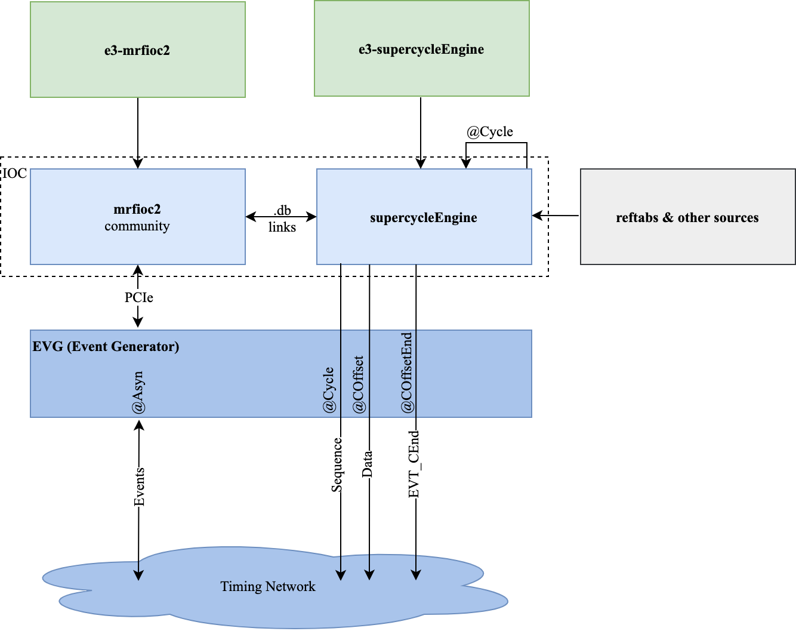

# "supercycleEngine" plugin for "epics-modules/mrfioc2".

# Description

"supercycleEngine" is an EPICS IOC plugin for the "mrfioc2" community release. It converts supercycles into cycles.

A supercycle is a set of cycles. Different supercycles can have different lengths.

Each cycle distributes:

-   Master Event Sequence (global events).
-   Data Buffer (global data packet).
-   [reftabs](https://gitlab.esss.lu.se/icshwi/reftabs.git) as input arguments.

# Design Diagram

# Cycle Specification

-   Operating frequency: 0-100Hz.
-   Sequential execution.

# Building

## Requirements

-   [mrfioc2](https://github.com/epics-modules/mrfioc2) >= 2.2.0
-   [EPICS Base](https://github.com/epics-base/epics-base) >= 3.14.10 (tested with base-7.0.3.1).
-   install \$(cat requirements.txt).

## Execute

-   Edit 'configure/CONFIG_SITE' and run TOP "make".

# Deployment

-   Designed to be built and deployed as e3 sideMods.
-   Use [e3-supercycleEngine]() project.

# Detailed documentation

-   [ESS Confluence](https://confluence.esss.lu.se/display/HAR/Supecycle)

# New feature request

-   Create "New issue"
